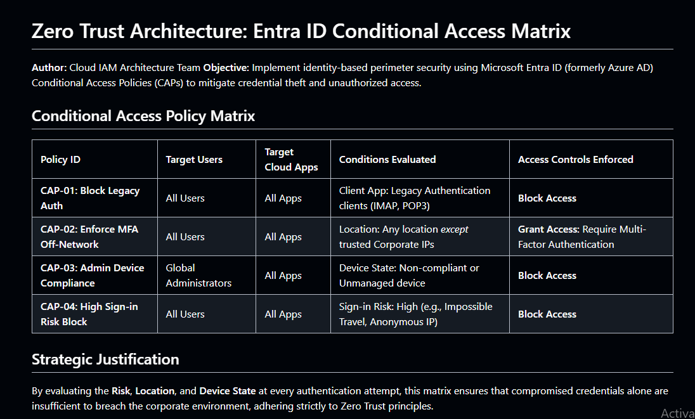

### Summary
Designed a Zero Trust architecture matrix utilizing Microsoft Entra ID (Azure AD) Conditional Access Policies to secure corporate cloud environments.

### Environment
* **Platform:** GitHub (Markdown Documentation)
* **Concepts:** Microsoft Entra ID, Azure AD, Zero Trust Architecture, Conditional Access, Identity and Access Management (IAM), Role-Based Access Control (RBAC).

### Diagnostic / Execution Steps
1. Analyzed enterprise identity risks, including legacy authentication vulnerabilities and impossible travel anomalies.
2. Authored a Conditional Access Policy (CAP) matrix to enforce Zero Trust principles across the cloud tenant.
3. Defined strict access controls requiring Multi-Factor Authentication (MFA) for off-network logins and compliant devices for highly privileged administrator roles.
4. Documented the policies in a standardized architectural format for stakeholder review.

### Evidence

### Lessons Learned
In modern cloud architecture, identity is the new security perimeter. Implementing Conditional Access Policies ensures that authentication is continuously evaluated for risk, location, and device health, neutralizing the threat of compromised passwords.
